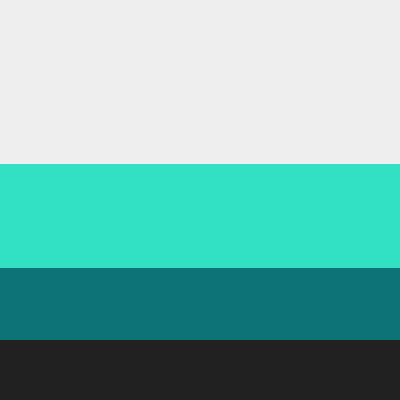

# 🌐 MySNS Project

## 🎯 목차
1. [기획의도](#기획의도)
2. [사이트 분석](#사이트-분석)
3. [개발 방향성 및 목표](#개발-방향성-및-목표)
4. [사이트맵](#사이트맵)
5. [Moodboard](#moodboard)
6. [색상](#색상)
7. [폰트](#폰트)
8. [기술 스택](#기술-스택)
9.  [개발 계획](#개발-계획)
10. [주요 기능](#주요-기능)

개발 기간 2024 09 02 ~ 2024 09 24 까지 
일정 
09.02 ~ 09.03 firebase 로그인 회원가입 기능 구현 및 디자인 
09.04 포스팅 crud 구현 및 toast 알림 
09.05 댓글 및 다크모드 

09.06 - 09.10 좋아요 기능 및 프로필 사진 업로드 사진 업로드 

9.11 ~ 9.13 채팅 구현 및 알림 설정  

 

## ✨ 기획의도
사용자 간의 소셜 네트워크를 통해 사진 및 경험을 공유할 수 있는 플랫폼을 제공하는 것이 목표입니다. 현대 사회의 디지털 커뮤니케이션의 중심이 되는 소셜 네트워크에서 개인의 목소리를 더욱 쉽고, 즐겁게 전달할 수 있도록 돕는 것을 목표로 합니다.

## 🔍 사이트 분석
경쟁 서비스로는 Instagram, Twitter 등이 있으며, 편리하고 직관적인 사용자 인터페이스를 제공합니다. 이러한 장점을 벤치마킹하면서, 기능과 디자인을 고려하여 개발할 계획입니다.

## 🚀 개발 방향성 및 목표
개발 방향은 사용자 경험을 극대화하는 것에 중점을 둡니다. 이를 위해 직관적인 UI, 빠른 응답 속도, 그리고 실시간 소통 기능을 강화할 계획입니다.

## 🎨 디자인 및 UX
MySNS의 디자인은 깔끔하고 모던하며, Material UI를 활용하여 사용자 친화적인 인터페이스를 지향합니다. 

아래의 색상들로 통해 시각적인 요소 또한 편한 분위기를 내봄

## 🎨 색상

- **#EEEEEE**: 기본 배경 색상
- **#32E0C4**: 주요 강조 색상
- **#0D7377**: 버튼 및 인터랙티브 요소 색상
- **#424242**: 텍스트 및 기본 UI 색상

## 🔤 폰트

- 기본 폰트 사용 예정 

## 🛠 기술 스택

## 📅 개발 계획

1. **기본 기능 구현**
   - Google Auth를 이용한 회원가입 및 로그인 기능
   - 프로필 설정 및 사진 업로드 기능
   - 팔로잉/팔로워 기능
   - 실시간 채팅 기능
   - Toast 알림 기능
   - 다크 모드 지원

2. **배포**
   - Firebase Hosting을 통한 배포

## 🎯 주요 기능

- **사진 업로드**: 사용자가 자신의 사진을 쉽고 빠르게 업로드할 수 있는 기능을 제공합니다.
- **Google 로그인**: Google 계정을 사용한 간편한 로그인 기능.
- **팔로잉/팔로워**: 사용자는 다른 사용자와 팔로우 관계를 맺어 활동을 공유할 수 있습니다.
- **실시간 채팅**: 팔로우한 사용자와 실시간으로 채팅이 가능합니다.
- **알림 기능**: 새로운 활동이 있을 때 Toast 메시지로 알림을 받습니다.

